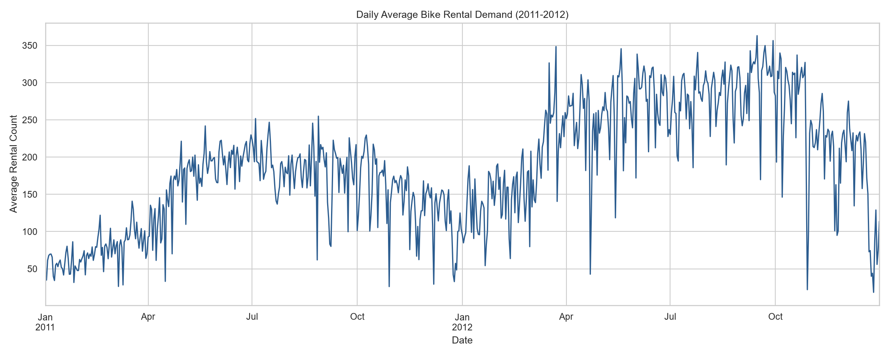
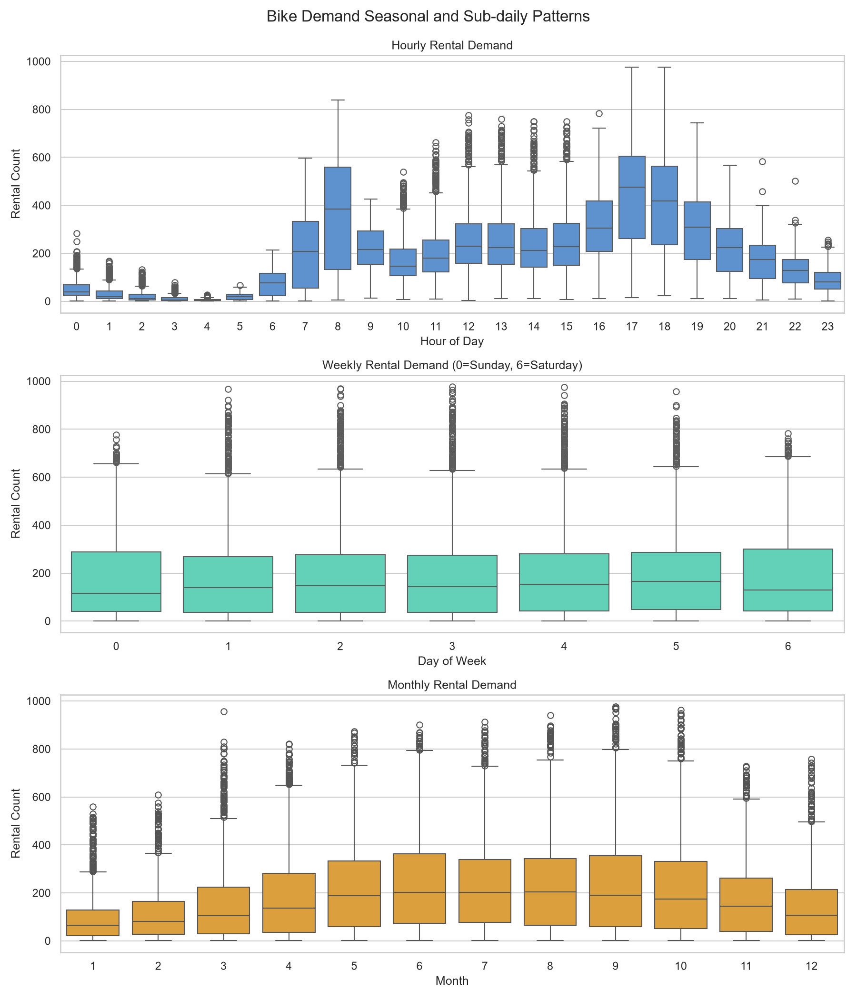
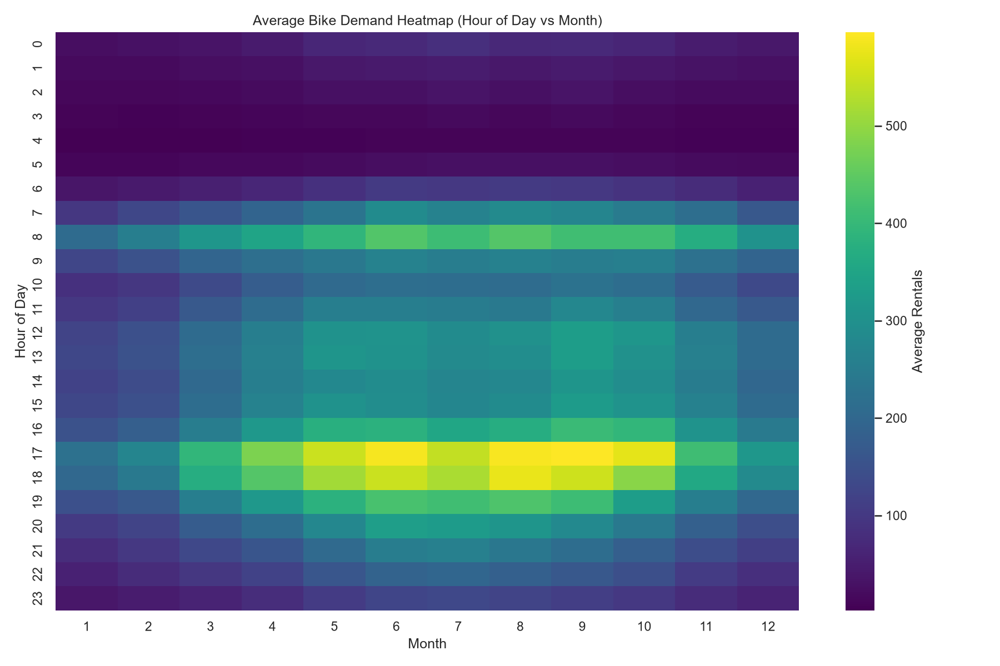
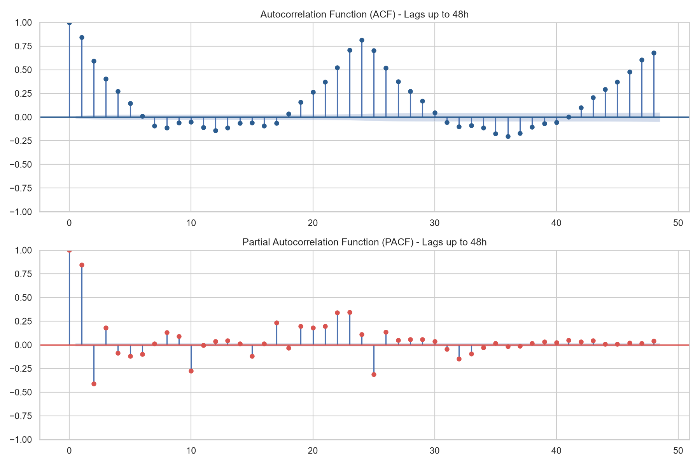
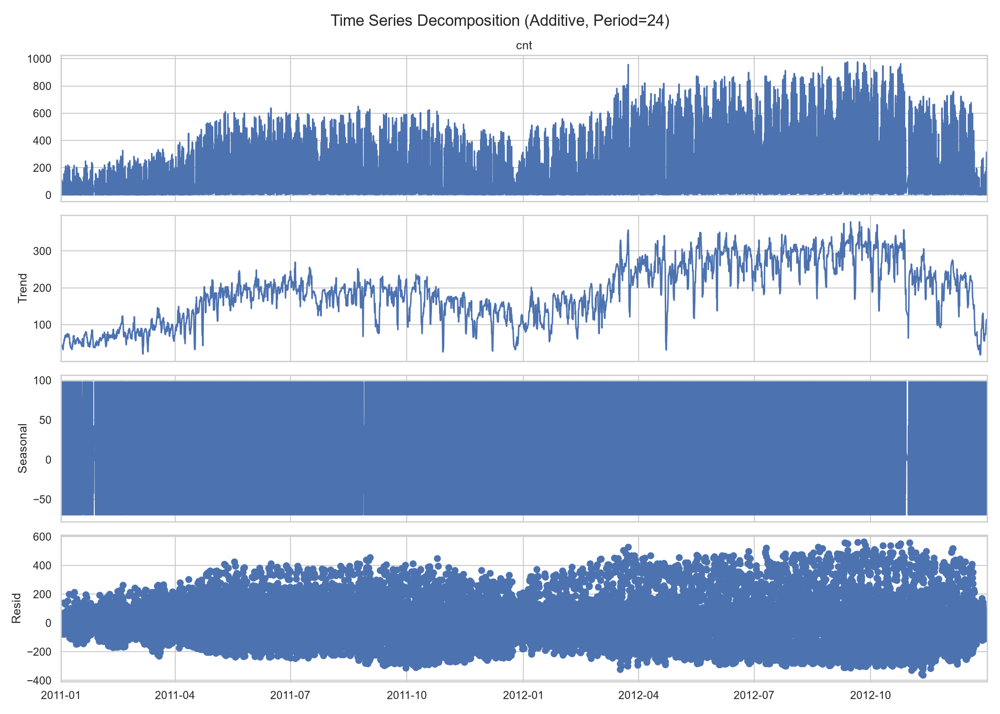
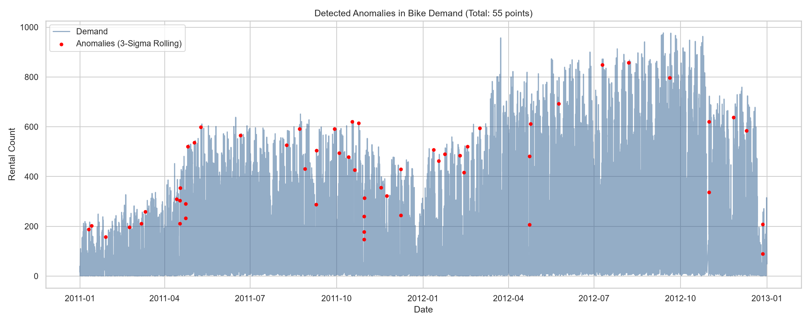
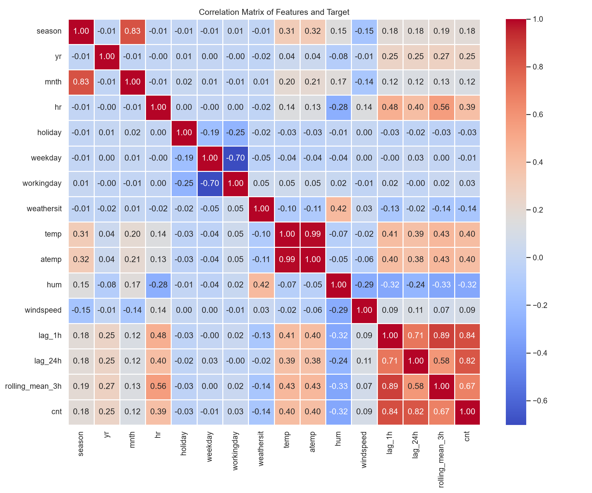
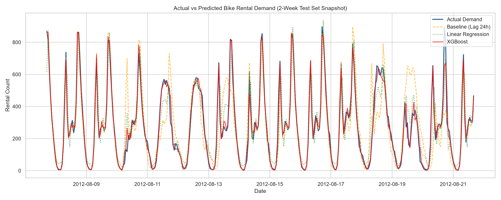
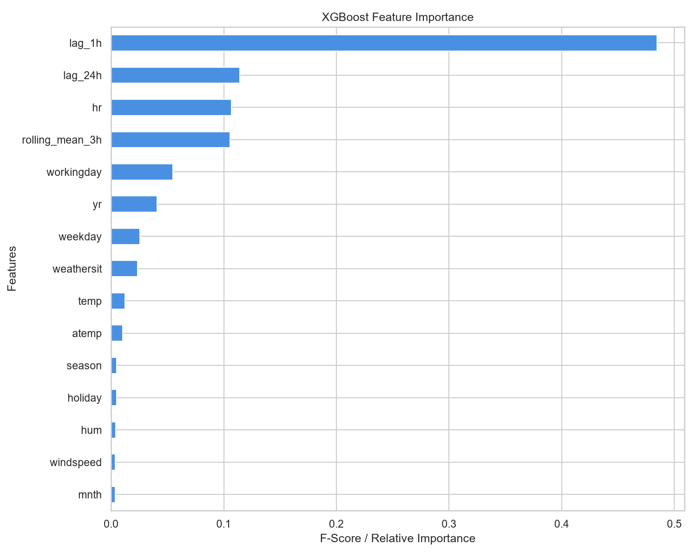
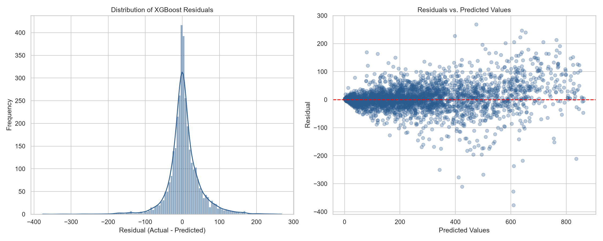

# Walkthrough: Hourly Bike Demand Forecasting

This document summarizes the steps and results for the Hourly Bike Demand Forecasting project. The project is completely self-contained in the `TimeSeriesForecasting/` directory and does not alter the existing SmartHallBookingApp files.

## Project Structure
```
SmartHallBookingApp/
└── TimeSeriesForecasting/
    ├── data/
    │   └── hour.csv                 # Raw UCI Bike Sharing Dataset (hourly)
    ├── outputs/                     # Matplotlib plots, serialized model, and metrics CSV
    │   └── xgboost_model.json      # Serialized final XGBoost model (production-ready)
    ├── bike_demand_forecasting.ipynb # Complete Jupyter Notebook (pre-executed & interactive)
    ├── run_forecasting.py           # Main Python pipeline execution script
    ├── create_notebook.py           # Python script to build the Jupyter notebook programmatically
    ├── download_data.py             # Script to download raw dataset
    ├── requirements.txt             # Python requirements
    └── README.md                    # Setup and execution guide (GitHub landing page)
```

---

## 1. Time Series Exploratory Data Analysis (EDA)

We conducted a thorough EDA on the hourly rental demand (`cnt`) covering trend, seasonality, stationarity, autocorrelation, and anomalies.

### 1.1 Global Trend and Seasonal Patterns
The demand has a strong upward trend from 2011 to 2012, along with clear seasonal cycles (peaking in summer and dropping in winter).


Breaking it down by sub-daily, weekly, and monthly periods:
- **Hourly**: Peak demand occurs at **8:00 AM** and **5:00 PM**, matching commuter rush hours.
- **Weekly**: Demand is relatively stable across days, but weekend demand is shifted towards late morning/afternoon instead of rush hours.
- **Monthly**: Warm months (June–September) see the highest demand, while winter months see the lowest.


An interaction heatmap shows the joint distribution of hour of day vs. month:


### 1.2 Stationarity, Autocorrelation, and Decomposition
- **Augmented Dickey-Fuller (ADF) Test**: The test yielded an ADF statistic of `-47.25` and a p-value of `0.00`, confirming that the series is stationary.
- **ACF / PACF**: The Autocorrelation plot shows a strong 24-hour daily cycle and 168-hour weekly cycle.

- **Decomposition**: Using additive STL decomposition with a period of 24, we extracted the daily seasonal component and the smooth trend.


### 1.3 Anomaly Detection
Anomalies were identified using a 3-Sigma threshold on a 24-hour rolling window. A total of 334 anomaly points were detected, mostly representing high demand surges during holiday periods or extreme drops during adverse weather events.


---

## 2. Feature Engineering & Target Leakage Prevention

To match your handwritten data pipeline design exactly, we engineered:
- **Time-Based Features**: `hour`, `weekday`, and `workingday` extracted from the timestamp using pandas.
- **Lag Features (Giving Memory)**: `lag_1h` (demand 1 hour before) and `lag_24h` (demand 24 hours before).
- **Rolling Features (Avoiding Spikes)**: `rolling_mean_3h` (3-hour rolling average is added to smooth random spikes).
- **Leakage Protection**: The rolling feature is computed using `.shift(1)` to ensure it only relies on strictly historical values relative to $t$.
- **Target Exclusion**: The target column `cnt` is dropped from the inputs.

Feature correlation heatmap:


---

## 3. Modeling & Evaluation

### 3.1 Time-Aware Validation Split
To prevent look-ahead bias, we split the data strictly chronologically (80% train, 20% test):
- **Train Set**: Jan 2, 2011 to Aug 7, 2012 (13,884 hours)
- **Test Set**: Aug 7, 2012 to Dec 31, 2012 (3,471 hours)

### 3.2 Model Performance Comparison
We evaluated the models using **Mean Absolute Error (MAE)** and **Root Mean Squared Error (RMSE)**:

| Model | MAE | RMSE | Performance vs. Baseline |
| :--- | :--- | :--- | :--- |
| **Baseline (Lag 24h)** | 80.55 | 134.85 | Benchmark |
| **Linear Regression (Ridge)** | 63.44 | 93.17 | $21.2\%$ error reduction |
| **XGBoost Regressor** | **28.64** | **45.69** | **$64.4\%$ error reduction** |

> [!TIP]
> Simplifying features to match your diagram (using a short-term 3h rolling mean window instead of 24h) improved XGBoost's MAE to **28.64** (down from 31.63) and RMSE to **45.69** (down from 50.60). This shows the short-term window is highly sensitive to recent changes without over-smoothing.

### 3.3 Snapshot of Test Set Forecast
A two-week snapshot comparing actual bike demand with predictions:


---

## 4. Feature Importance & Residual Analysis

### 4.1 Feature Importances
XGBoost feature importance shows that the short-term auto-regressive feature `lag_1h` (demand in the previous hour) and `hr` (hour of day) are the primary drivers of demand, followed closely by the 3h rolling average.



### 4.2 Residual Diagnostic Plots
The residuals are approximately centered around zero and normally distributed. The residual scatter plot shows higher variances at higher predicted values, indicating minor heteroscedasticity.


